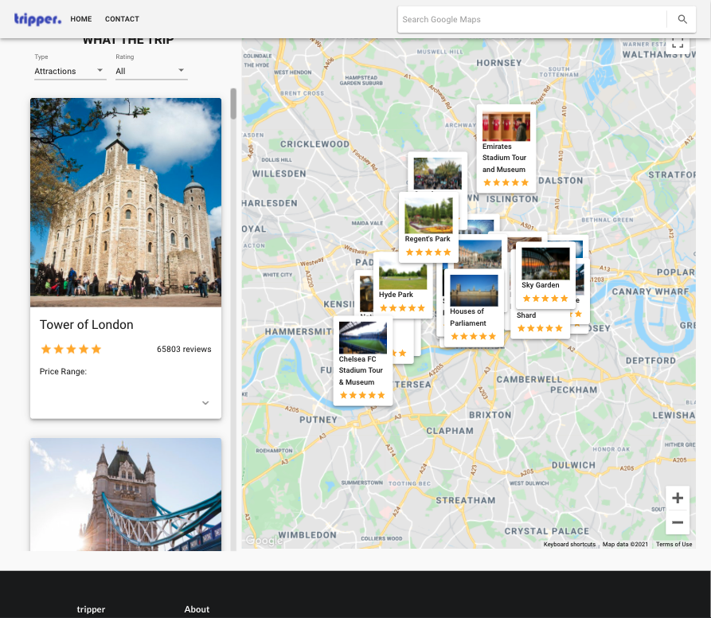
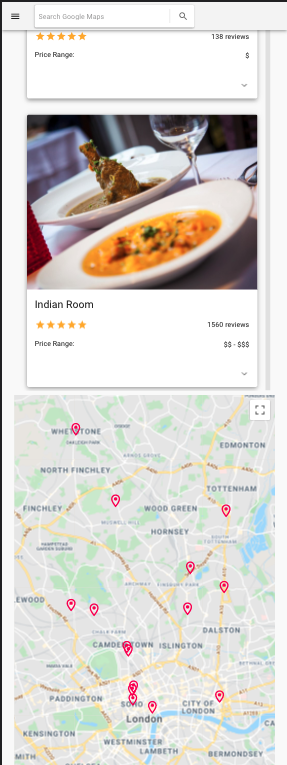

# tripper.

## Description

A Travel advisor app built uising React and API's from Google MAPS and RAPID API `Travel Advisor` API. The App
has geolocation allowing it to auto locate the user's location. 

Users are able to search locations using the search function, and are able to filter results by type `Hotels, Restaurants, Attractions` and/or by Rating.

There is also an additional contact feature that if set up through `EmailJS` will enable user to send messages directly to you through the app.

The app uses Material Ui, Semantic Ui along with CSS to create the user interface.

Future development: Add weather feature using weather API that auto updates based on location.

## Screenshots

  ## Contents Table
  - [Installation](#Installation)
  - [Usage](#|Usage)
  - [Collaborators](#Collaborators)
  - [License](#License)
  - [Author](#Author)

## Installation

To install the app, clone the repo from GitHub, open in VS Code and open the terminal:

* step 1 `npm install`
* step 2 `npm run build`
* step 3 `npm run start`

Ensure all dependencies and dev dependencies are installed if you encounter errors (npm install {package}).

## Usage

As this app uses API's you will need to generate the following API KEYs:

* REACT_APP_GOOGLE_MAPS_API_KEY=
* REACT_APP_RAPID_API_TRAVEL_API_KEY=
* REACT_APP_RAPID_API_HOST=

API
[RAPID API](https://rapidapi.com/hub?utm_source=youtube.com%2FJavaScriptMastery&utm_medium=DevRel&utm_campaign=DevRel)

[Travel Adviser API](https://rapidapi.com/apidojo/api/travel-advisor?utm_source=youtube.com%2FJavaScriptMastery&utm_medium=DevRel&utm_campaign=DevRel)
* Once an account is created, subscribe to the above API, once subscribed ensure to group the relevant API KEY.

[Google Maps](https://console.cloud.google.com/home/dashboard)
* You will need to create a new project and search for MAps JavaScript API, once enabled obtain the API KEY. You will also need to search for Places API and click enable this will allow the search function to work.

[Email.js](https://www.emailjs.com/)
* For the contact feature to work you will need to create a free email js account and link your email. Once done obtain the relevant API for the below section on your .env file.

* REACT_APP_SERVICE_ID=
* REACT_APP_TEMPLATE_ID=
* REACT_APP_USER_ID=

Once all the relevant API Keys are obtained add them to your .env file. Once done if you have already started the app you will need to run `npm run build` and then `npm run start`.

## Collaborators
none

## License
- 
- [title](https://opensource.org/licenses/MIT)
- [title](https://opensource.org/licenses/MIT)

## Author
- Wael Ahmed
- Find heroku app deployment on: https://app-tripper.herokuapp.com/

